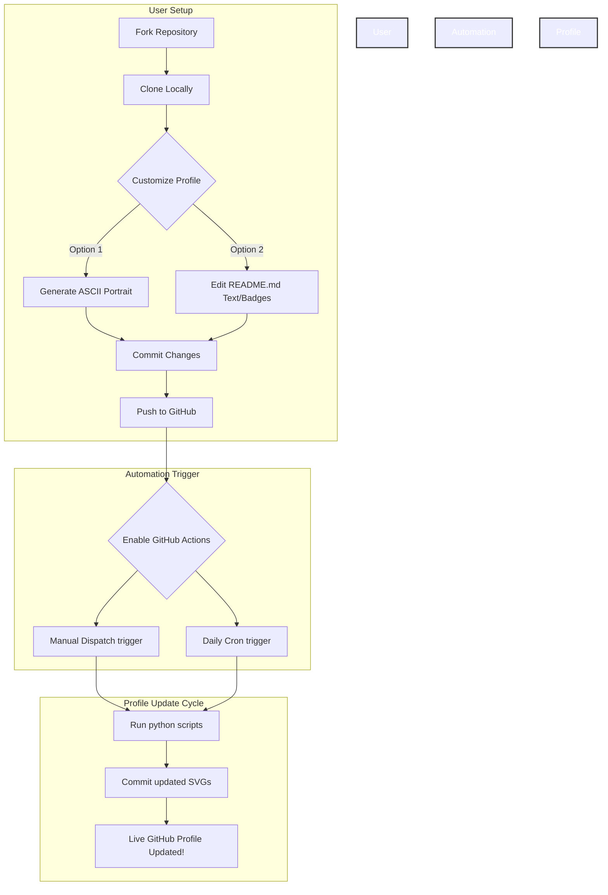
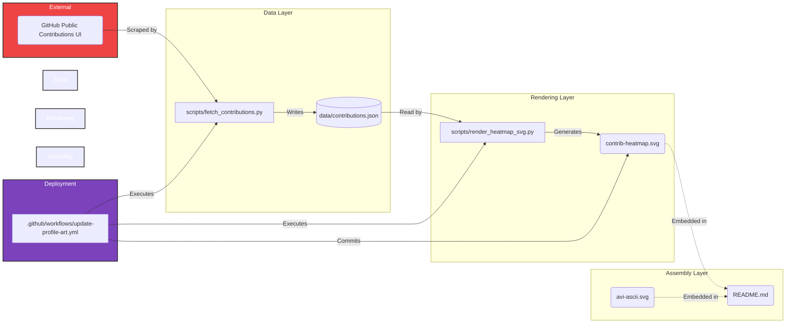

# 🏗️ Technical Architecture

This document outlines how the automated GitHub Profile updates itself without any external infrastructure or complicated authentication.

## How It Works

The architecture relies on a "Self-Updating Repository" pattern. 
1. GitHub Actions spins up a runner every day at a scheduled time.
2. The Action runs Python scripts that scrape your public contribution graph (using `BeautifulSoup`).
3. The scripts process the data locally and render it into a visually appealing SVG Heatmap (`contrib-heatmap.svg`).
4. The Action uses its default `$GITHUB_TOKEN` to commit the updated SVG back into the same repository, meaning your live profile automatically refreshes!

## 1. Implementation Flow Chart

This diagram illustrates the end-to-end process from forking the repository to the automated daily updates.

## 2. Components Connection Flow Chart

This diagram details exactly how the files in this repository interact with each other and the external GitHub API.

## No Tokens Required
Because the Python script (`fetch_contributions.py`) hits GitHub's unauthenticated public HTML endpoint (`https://github.com/users/USERNAME/contributions`), you don't have to deal with rate-limited APIs, GraphQL queries, or Personal Access Tokens. It just works.
