<table>
<tr>
<td valign="top"></td>
<td valign="top"></td>
</tr>
</table>

## RAHUL TRIPATHI

**Principal Cloud & Systems Architect · Azure · AI Platform Architecture**

 

<!-- animated contribution graph, refreshed daily by the workflow -->

