<!-- ═══════════════════════════════════════════════════════════════════════
     RAHUL TRIPATHI — GitHub Profile README
     ═══════════════════════════════════════════════════════════════════════ -->

<div align="center">

# 👋 Hi, I'm Rahul Tripathi

### Principal Cloud & Systems Architect @ Amadeus Labs

**Enterprise Cloud Architecture** 🔹 **Secure AI Platforms** 🔹 **Infrastructure Automation** 🔹 **Zero Trust**

<br/>

</div>

<!-- ░░░░░░░░░░░ ASCII PORTRAIT + SYSTEM INFO ░░░░░░░░░░░ -->
<table align="center" border="0" cellpadding="0" cellspacing="0">
<tr>
<td valign="top">



</td>
<td valign="top">

```yaml
# SYSTEM_INFO
name:      Rahul Tripathi
role:      Principal Cloud & Systems Architect
company:   Amadeus Labs, Bengaluru
experience: 12+ years

core_discipline: End-to-End Distributed Systems
  # HLD → LLD
high_level:
  - Reference architectures & domain boundaries
  - Network topology & failure modes
low_level:
  - Component design & interface contracts
  - Data flows & identity/access models

architecture_scope:
  - Web Apps, Azure Functions, ACR Microservices
  - Cosmos DB, SQL, Azure AI Search
  - Landing Zones & Zero Trust Perimeters

currently_architecting:
  - Enterprise landing zones (Hub-and-Spoke)
  - Secure AI platforms on Azure AI Foundry
  - Multi-agent orchestration (MCP + A2A)
```

</td>
</tr>
</table>

<div align="center">

[](https://linkedin.com/in/rahul-tripathi-a05a1693)
[](mailto:tripathi.rahultripathi1992@gmail.com)
[](https://github.com/techtotsandparents-max/rahulsite)

</div>

---

<!-- ░░░░░░░░░░░ TECH STACK ░░░░░░░░░░░ -->
<h3 align="center">⚡ Core Technologies</h3>

<div align="center">

**Cloud Platforms**<br/>


<br/>

**Infrastructure & DevOps**<br/>


<br/>

**Security & Architecture**<br/>


</div>

---

<!-- ░░░░░░░░░░░ CERTIFICATIONS ░░░░░░░░░░░ -->
<h3 align="center">🏅 Certifications</h3>

<div align="center">

**Microsoft Certified: Architect AI Solutions for Business Productivity (AB-100)**<br/>
**Microsoft Certified: Azure Solutions Architect Expert (AZ-300 / AZ-301)**<br/>
**Microsoft Certified: Azure Security Engineer Associate (AZ-500)**<br/>
**Microsoft Certified: Azure Administrator Associate (AZ-103)**<br/>
**MCSE: Cloud Platform and Infrastructure**<br/>
**ITIL Foundation, IT Service Management**

</div>

---

<!-- ░░░░░░░░░░░ KEY HIGHLIGHTS ░░░░░░░░░░░ -->
<h3 align="center">🏆 Professional Impact</h3>

<div align="center">

|   | Achievement |
|:---:|:---|
| 🏗️ | Designed **enterprise landing zones & hub-and-spoke networking** — now the reference pattern across all engineering teams |
| ⚡ | Led cloud migrations with **zero unplanned production downtime** |
| 💰 | Implemented governance automation that **reduced cloud spend by 30%** |
| 🤖 | Architected **secure AI platform on Azure AI Foundry** with strict tenant isolation & network security |
| 🔗 | Built **MCP + A2A multi-agent orchestration** for enterprise AI systems |
| 🛡️ | Led **identity & access architecture** on Entra ID across highly complex multi-tenant environments |
| 📐 | Chair **architecture reviews as Design Authority** ensuring scalable, secure deployments |

</div>

---

<!-- ░░░░░░░░░░░ GITHUB STATS ░░░░░░░░░░░ -->
<h3 align="center">📊 GitHub Analytics</h3>

<div align="center">
  
  
</div>

<br/>

<div align="center">
  
</div>

<br/>

<div align="center">
  
</div>

---

<!-- ░░░░░░░░░░░ CURRENTLY WORKING ON ░░░░░░░░░░░ -->
<h3 align="center">🔭 Currently Working On</h3>

```diff
+ Enterprise Azure Landing Zone automation with Terraform
+ Secure AI Platform Architecture on Azure AI Foundry
+ Multi-agent orchestration using MCP and Agent2Agent (A2A)
+ Open-source Terraform module library for Azure best practices
```

---

<!-- ░░░░░░░░░░░ FOOTER ░░░░░░░░░░░ -->
<div align="center">


<br/>

> *"I define the standards other engineering teams build against while staying close to implementation to validate that designs work reliably in production."*

---

⭐ *From [Rahul Tripathi](https://github.com/techtotsandparents-max)*

</div>
